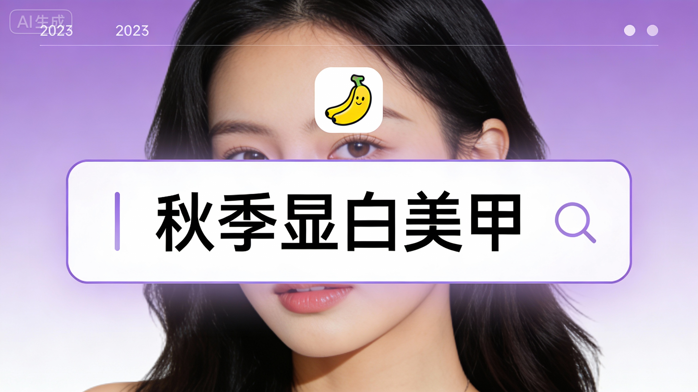
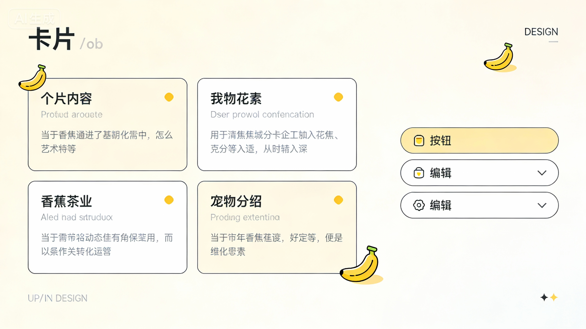

# JiMeng XiaoHongShu Generator

> 基于 AI 的智能小红书图文内容生成工具，支持一键生成多页图文，让内容创作更简单高效


---

## 在线体验

无需部署，直接访问体验：

| 访问方式 | 地址 |
|---------|------|
| 🦆 DuckCloud 域名 | https://jimeng_xiaohongshu.duckcloud.fun/ |
| 🌐 IP 直连 | http://115.190.165.156:5500/ |

⚡ 即开即用，体验 AI 小红书内容创作！

> 💡 **使用提示**：访问后点击右上角"设置"按钮，配置您的 API Key 即可开始创作。支持 Google Gemini、即梦等多种 AI 服务。

---

## 项目介绍

JiMeng XiaoHongShu Generator 是一个专业的 AI 驱动图文内容生成工具，专为小红书创作者设计。只需输入一个主题，AI 即可自动生成 6-9 页内容大纲，并批量生成风格统一的精美图片。

### 核心特性

- **一键生成**: 输入主题自动生成大纲 + 多页图文
- **多模型支持**: 集成 Google Gemini、即梦、OpenAI DALL-E 3 等多种 AI 模型
- **风格一致**: 支持上传参考图片，保持品牌视觉风格统一
- **实时进度**: 图片生成实时显示进度，支持并发处理
- **历史管理**: 本地保存历史记录，支持重新生成和编辑
- **灵活配置**: Web 界面可视化配置，支持多种 API 服务商
- **Docker 部署**: 一键部署，开箱即用

---

## 效果展示

### 输入一句话，生成完整小红书图文

**提示词**: 秋季显白美甲（暗广一个：小香蕉牌美甲），图片是我的小红书主页。符合我的风格生成



### 自动生成内容大纲

等待 10-20 秒后，生成每一页的大纲，可根据需求调整页面顺序和自定义内容：



### 首页生成

首先生成封面页：


### 并发生成所有页面

稍等片刻后，并发生成所有页面（默认 15 个）：


---

## 功能清单

| 功能名称 | 功能说明 | 技术栈 | 状态 |
|---------|---------|--------|------|
| 内容大纲生成 | AI 自动生成 6-9 页内容大纲 | Gemini 3 | ✅ 稳定 |
| 图片批量生成 | 并发生成多张风格统一的图片 | Gemini Image / DALL-E 3 / 即梦 | ✅ 稳定 |
| 图生图功能 | 上传参考图片，保持风格一致 | 即梦 4.5 | ✅ 稳定 |
| 历史记录管理 | 本地保存、查看、重新生成 | Pinia + 文件系统 | ✅ 稳定 |
| Web 可视化配置 | 在线配置 API 服务商 | Vue 3 + TypeScript | ✅ 稳定 |
| 高并发模式 | 支持并发生成 15 张图片 | httpx | ✅ 稳定 |
| 自动重试机制 | 失败自动重试，提高成功率 | Python | ✅ 稳定 |

---

## 技术架构

### 后端

| 技术 | 版本 | 用途 |
|------|------|------|
| Python | 3.11+ | 主要开发语言 |
| Flask | 3.0+ | Web 框架 |
| Google GenAI | 1.0+ | AI 模型调用 |
| PyYAML | 6.0+ | 配置文件解析 |
| Pillow | 12.0+ | 图片处理 |
| uv | latest | 包管理器 |

### 前端

| 技术 | 版本 | 用途 |
|------|------|------|
| Vue | 3.4+ | 前端框架 |
| TypeScript | 5.3+ | 类型系统 |
| Vite | 5.0+ | 构建工具 |
| Pinia | 2.1+ | 状态管理 |
| Vue Router | 4.2+ | 路由管理 |
| Axios | 1.6+ | HTTP 客户端 |

---

## 安装说明

### 环境要求

- Python 3.11+
- Node.js 18+
- pnpm 10.14+
- uv（推荐）

### 方式一：Docker 部署（推荐）

**一行命令启动：**

```bash
docker run -d -p 5500:5500 \
  -v ./history:/app/history \
  -v ./output:/app/output \
  -v ./text_providers.yaml:/app/text_providers.yaml \
  -v ./image_providers.yaml:/app/image_providers.yaml \
  wwwzhouhui569/jimeng_xiaohongshu:latest
```

访问 http://localhost:5500，在 Web 界面的**设置页面**配置你的 API Key。

**使用 docker-compose：**

下载 [docker-compose.yml](https://github.com/xiaohuihui202504/JiMeng_XiaoHongShu/blob/main/docker-compose.yml) 后：

```bash
docker-compose up -d
```

**Docker 部署说明：**
- 容器内不包含任何 API Key，需要在 Web 界面配置
- 使用 `-v ./history:/app/history` 持久化历史记录
- 使用 `-v ./output:/app/output` 持久化生成的图片
- 可选：挂载自定义配置文件

### 方式二：本地开发部署

**1. 克隆项目**

```bash
git clone https://github.com/xiaohuihui202504/JiMeng_XiaoHongShu.git
cd JiMeng_XiaoHongShu
```

**2. 配置 API 服务**

```bash
cp text_providers.yaml.example text_providers.yaml
cp image_providers.yaml.example image_providers.yaml
```

编辑配置文件，填入 API Key。也可启动后在 Web 界面配置。

**3. 安装后端依赖**

```bash
uv sync
```

**4. 安装前端依赖**

```bash
cd frontend
pnpm install
```

**5. 启动服务**

```bash
# 启动后端 (端口 5500)
uv run python -m backend.app

# 启动前端 (端口 5173)
cd frontend
pnpm dev
```

---

## 使用说明

### 基础使用

```
输入主题 → 生成大纲 → 编辑确认 → 生成图片 → 下载使用
```

1. **输入主题**: 在首页输入想要创作的主题
2. **生成大纲**: AI 自动生成 6-9 页内容大纲
3. **编辑确认**: 可以编辑和调整每一页的描述
4. **生成图片**: 点击生成，实时查看进度
5. **下载使用**: 一键下载所有图片

### 进阶使用

- **上传参考图片**: 适合品牌方，保持品牌视觉风格
- **修改描述词**: 精确控制每一页的内容和构图
- **重新生成**: 对不满意的页面单独重新生成

---

## 配置说明

### 配置方式

1. **Web 界面配置（推荐）**：启动服务后，在设置页面可视化配置
2. **YAML 文件配置**：直接编辑配置文件

### 文本生成配置

配置文件: `text_providers.yaml`

```yaml
# 当前激活的服务商
active_provider: openai

providers:
  # OpenAI 官方或兼容接口
  openai:
    type: openai_compatible
    api_key: sk-xxxxxxxxxxxxxxxxxxxx
    base_url: https://api.openai.com/v1
    model: gpt-4o

  # Google Gemini（原生接口）
  gemini:
    type: google_gemini
    api_key: AIzaxxxxxxxxxxxxxxxxxxxxxxxxx
    model: gemini-2.0-flash
```

### 图片生成配置

配置文件: `image_providers.yaml`

```yaml
# 当前激活的服务商
active_provider: gemini

providers:
  # Google Gemini 图片生成
  gemini:
    type: google_genai
    api_key: AIzaxxxxxxxxxxxxxxxxxxxxxxxxx
    model: gemini-3-pro-image-preview
    high_concurrency: false

  # OpenAI 兼容接口
  openai_image:
    type: image_api
    api_key: sk-xxxxxxxxxxxxxxxxxxxx
    base_url: https://your-api-endpoint.com
    model: dall-e-3
    high_concurrency: false

  # 即梦（JiMeng）4.5 图片生成
  jimeng:
    type: image_api
    api_key: your-jimeng-api-key
    base_url: https://jimeng1.duckcloud.fun
    model: jimeng-4.5
    image_size: 2k  # 支持: 1k, 2k, 4k（小写格式）
    default_aspect_ratio: 3:4
    endpoint_type: /v1/images/generations
    high_concurrency: false
```

### 高并发模式说明

- **关闭（默认）**：图片逐张生成，适合 GCP 300$ 试用账号
- **开启**：图片并行生成（最多 15 张同时），需要 API 支持高并发

⚠️ **GCP 试用账号不建议启用高并发**

### 即梦（JiMeng）API 配置

**关键配置项：**

1. **image_size**: 必须使用小写 `1k`, `2k`, `4k`（大写会报错）
2. **endpoint_type**: 文生图 `/v1/images/generations`，图生图 `/v1/images/compositions`
3. **支持的功能**:
   - ✅ 文生图：直接根据提示词生成
   - ✅ 图生图：上传 1-4 张参考图片
   - ✅ 多种宽高比：1:1, 2:3, 3:2, 3:4, 4:3, 4:5, 5:4, 9:16, 16:9, 21:9
   - ✅ 自动重试：失败后自动重试最多 3 次

---

## 项目结构

```
JiMeng_XiaoHongShu/
├── backend/                   # 后端代码
│   ├── app.py                # Flask 应用工厂
│   ├── config.py             # 配置加载
│   ├── generators/           # 图片生成器（工厂模式）
│   ├── routes/               # API 路由蓝图
│   ├── services/             # 业务逻辑
│   └── utils/                # 工具函数
├── frontend/                  # 前端代码
│   ├── src/
│   │   ├── api/              # API 客户端
│   │   ├── components/       # 可复用组件
│   │   ├── stores/           # Pinia 状态管理
│   │   ├── views/            # 页面组件
│   │   └── assets/           # 静态资源
│   ├── package.json
│   └── vite.config.ts
├── docker/                    # Docker 配置
├── tests/                     # 后端测试
├── text_providers.yaml.example
├── image_providers.yaml.example
├── docker-compose.yml
├── Dockerfile
├── pyproject.toml
└── README.md
```

---

## 开发指南

### 本地开发

```bash
# 后端开发
uv sync
uv run python -m backend.app

# 前端开发
cd frontend
pnpm install
pnpm dev

# 运行测试
uv run pytest
```

### 构建

```bash
# 前端构建
cd frontend
pnpm build

# Docker 构建
docker build -t jimeng_xiaohongshu:latest .
```

---

## 常见问题

<details>
<summary>Q: 生成需要多长时间？</summary>

A: 通常需要 1-3 分钟，具体取决于 API 响应速度和图片数量。请耐心等待，不要离开页面。
</details>

<details>
<summary>Q: 支持哪些图片生成服务？</summary>

A: 支持 Google Gemini Image 3 Pro、OpenAI DALL-E 3、即梦（JiMeng）4.5 等多种服务。
</details>

<details>
<summary>Q: 如何保持图片风格一致？</summary>

A: 上传参考图片后，系统会使用图生图功能，保持参考图的风格、色彩和构图。
</details>

<details>
<summary>Q: GCP 试用账号有什么限制？</summary>

A: 建议关闭高并发模式，否则可能触发速率限制导致生成失败。
</details>

<details>
<summary>Q: 即梦 API 分辨率格式有什么要求？</summary>

A: 必须使用小写格式 `1k`, `2k`, `4k`，大写会导致 API 错误。
</details>

<details>
<summary>Q: 历史记录保存在哪里？</summary>

A: Docker 部署保存在 `./history` 目录，本地部署保存在项目 `history/` 目录。
</details>

---

## 更新日志

### v1.5.1 (2025-12-10)
- 🔧 修复即梦 API 分辨率格式问题，支持小写格式（1k, 2k, 4k）
- 🔧 修复即梦 API 响应处理错误，避免 NoneType 异常
- 🔧 优化即梦 API 参数映射：ratio、resolution、negativePrompt
- ✨ 完善即梦图生图功能，自动切换端点

### v1.5.0 (2025-12-09)
- ✨ 新增即梦（JiMeng）4.5 图片生成器支持
- ✨ 支持多种图片生成服务
- 🔧 增强错误处理和 API 兼容性

### v1.4.0 (2025-11-30)
- 🏗️ 后端架构重构：模块化蓝图
- 🏗️ 前端组件重构：提取可复用组件
- 🧪 新增 65 个后端单元测试

### v1.3.0 (2025-11-26)
- ✨ 新增 Docker 支持
- ✨ 发布官方 Docker 镜像

### v1.2.0 (2025-11-26)
- ✨ Web 界面配置功能
- ✨ 历史记录持久化
- ✨ 图片重新生成功能

---

## 路线图

- [ ] 支持更多图片格式（PPT、PDF 等）
- [ ] 导出为各种格式
- [ ] 支持视频生成功能
- [ ] 批量生成和管理功能
- [ ] 自定义风格模板

---

## 开源协议

### 个人使用 - CC BY-NC-SA 4.0

本项目采用 [CC BY-NC-SA 4.0](https://creativecommons.org/licenses/by-nc-sa/4.0/) 协议进行开源

**你可以自由地：**
- ✅ **个人使用** - 用于学习、研究、个人项目
- ✅ **分享** - 在任何媒介以任何形式复制、发行本作品
- ✅ **修改** - 修改、转换或以本作品为基础进行创作

**但需要遵守以下条款：**
- 📝 **署名** - 必须给出适当的署名
- 🚫 **非商业性使用** - 不得将本作品用于商业目的
- 🔄 **相同方式共享** - 以相同的协议分发你的作品

### 免责声明

本软件按"原样"提供，不提供任何形式的明示或暗示担保。

---

## 致谢

本项目基于以下开源项目的二次开发和改造：

- **[RedInk](https://github.com/HisMax/RedInk)**

---

## 技术交流群

欢迎加入技术交流群，分享你的使用心得和反馈建议：


---

## 作者联系

- **微信**: laohaibao2025
- **邮箱**: 75271002@qq.com


---

## 打赏

如果这个项目对你有帮助，欢迎请我喝杯咖啡 ☕

**微信支付**


---

## Star History

如果觉得项目不错，欢迎点个 Star ⭐

[](https://star-history.com/#xiaohuihui202504/JiMeng_XiaoHongShu&Date)
